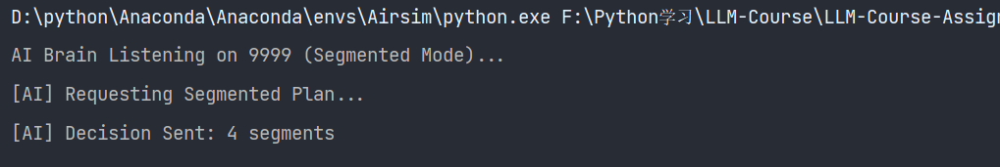
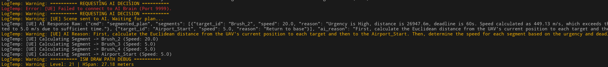
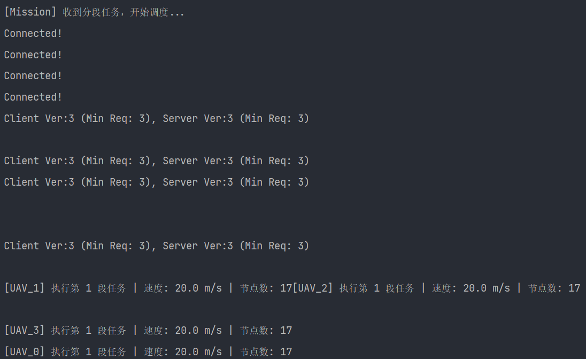

# 作业04-UAV: 基于 GeoSOT 与 LLM 驱动的无人机集群协同系统

---

## 1. 项目概述 (Project Overview)

### 1.1 背景
随着低空经济的快速发展，多无人机（UAV Swarm）协同作业在城市巡检、搜索救援等场景中扮演着越来越重要的角色。然而，传统的集群控制往往依赖预设规则，缺乏对突发紧急情况（如临时出现的紧急救援目标）的语义理解和动态决策能力。

### 1.2 目标
本项目旨在构建一个**大脑-小脑-肢体**仿生架构的无人机集群协同系统：
* **大脑 (LLM)**：使用 **DeepSeek-V3** 大语言模型进行战术决策，解析自然语言/场景语义，规划任务优先级和飞行速度。
* **小脑 (UE5 + GeoSOT)**：基于 **北斗网格位置码 (GeoSOT)** 进行空间离散化建模，利用 A* 算法生成无碰撞的网格飞行走廊。
* 
* **肢体 (Cosys-AirSim)**：在基于真实地理坐标（Cesium）的物理仿真环境中执行高精度的飞行控制。
* 

---

## 2. 模拟环境配置 (Simulation Environment Configuration)

为了复现本项目，需严格按照以下版本配置环境，以确保 Cesium 地理坐标与 Cosys-AirSim 的兼容性。

### 2.1 基础软件环境
* **操作系统**: Windows 11 / Windows 10
* **开发工具**: Visual Studio 2022 (v17.8+, 用于编译 UE 5.4 C++)
* **游戏引擎**: **Unreal Engine 5.4**
* **仿真插件**: **Cosys-AirSim** (支持 UE 5.x 的 AirSim 活跃分支)
* **地理插件**: **Cesium for Unreal** (适配 UE 5.4 版本)
* **Python环境**: Python 3.8+ (推荐 Anaconda)

### 2.2 Unreal Engine 项目依赖 (`.Build.cs`)
在项目的 `Build.cs` 文件中，必须添加以下核心模块以支持网络通信、JSON 解析及 Cesium 依赖：
```csharp
PublicDependencyModuleNames.AddRange(new string[] { 
    "Core", "CoreUObject", "Engine", "InputCore", 
    "Sockets", "Networking",        // TCP 通信
    "Json", "JsonUtilities",        // JSON 协议解析
    "GeoSOTSystem",                 // 自定义网格系统
    "CesiumRuntime"                 // Cesium 地理插件支持
});
```
### 2.3 AirSim 配置文件 (settings.json)
请将以下配置保存至 Documents\AirSim\settings.json。
注意 OriginGeopoint 需与 Cesium 中的 CesiumGeoreference 原点保持一致：
```json
{
  "SettingsVersion": 1.2,
  "SimMode": "Multirotor",
  "OriginGeopoint": {
    "Latitude": 34.223,
    "Longitude": 108.912,
    "Altitude": 400
  },
  "Vehicles": {
    "UAV_0": { "VehicleType": "SimpleFlight", "X": 0, "Y": 0, "Z": 0 },
    "UAV_1": { "VehicleType": "SimpleFlight", "X": 3, "Y": 0, "Z": 0 },
    "UAV_2": { "VehicleType": "SimpleFlight", "X": 0, "Y": 3, "Z": 0 },
    "UAV_3": { "VehicleType": "SimpleFlight", "X": 3, "Y": 3, "Z": 0 }
  }
}
```
## 3. 系统架构 (System Architecture)
系统采用分布式模块化设计，通过 TCP Socket 实现 Python 决策层与 UE5 仿真层的实时通信。
### 3.1 大脑模块 (LLM Decision Layer)
* 使用 DeepSeek-V3 进行自然语言理解和任务规划。
* 基于任务优先级和环境语义，生成飞行指令和速度调整建议。
* 通过 TCP Socket 将指令发送至 UE5 小脑模块。
* 
### 3.2 小脑模块 (UE5 + GeoSOT)
* 利用 GeoSOT 进行空间离散化，构建三维网格模型。
* 基于 A* 算法生成无碰撞的飞行路径。
* 接收大脑模块的指令，调整飞行路径和速度。
* 将路径指令发送至肢体模块。
* 
* 
### 3.3 肢体模块 (Cosys-AirSim)
* 在基于 Cesium 的物理仿真环境中执行飞行控制。
* 根据小脑模块的路径指令，控制无人机的实际飞行。
* 实时反馈飞行状态至小脑模块。
* 监测环境变化，反馈至大脑模块进行动态调整。
* 
* ## 4. 关键技术实现 (Key Technical Implementations)
### LLM 驱动的战术规划
使用 DeepSeek-V3 模型作为集群指挥官。
* 输入：包含目标坐标、紧急程度（High/Medium/Low）、截止时间（Deadline）的 JSON 数据。
* 动态决策：模型能根据 Deadline 自动计算所需的飞行速度（例如：若时间紧迫，速度提升至 15m/s；若常态巡检，保持 5m/s）。
### 4.2 GeoSOT 全球剖分网格
* 利用 GeoSOT 进行三维空间离散化，生成统一的网格编码。
* 基于 A* 算法进行路径规划，确保无人机在复杂环境中避障飞行。
* 实现多无人机间的协同避让，防止碰撞。
## 5. 实现细节与难点攻克 (Implementation & Challenges)

### 5.1 难点一：Cesium 绝对高度与网格分层的冲突
* **问题描述**：GeoSOT 第 21 级网格在高度维度的跨度（HSpan）约为 27 米。若直接将网格中心高度传给 AirSim，会导致无人机产生“爬楼梯”式的剧烈高度跳变（例如从 2米突然跳变到 29米），且可能因 Cesium 原点与网格高度层未对齐而导致无人机试图钻入地下。
* **解决方案**：
    1.  **引入 `BaseAltitude` 概念**：在计算路径前，记录起点（Airport）在 Cesium 中的真实海拔高度。
    2.  **相对高度计算**：采用公式 `FinalHeight = BaseAltitude + (h_grid - h_start) * HSpan`，确保路径点始终基于起飞平面的相对高度。
    3.  **同层锁定**：在 A* 寻路时强制 `EndAlt = StartAlt`，确保巡检任务在同一相对高度层进行，消除不必要的爬升动作。

### 5.2 难点二：Cosys-AirSim 坐标系对齐
* **问题描述**：UE5/Cesium 使用 **Z-Up 左手坐标系**（单位：厘米），而 Cosys-AirSim 使用 **NED (North-East-Down) 右手坐标系**（单位：米）。直接数值传递会导致无人机坐标错乱或高度反转。
* **解决方案**：
    1.  **移除错误钳制**：移除了代码中错误的 `MinH` 绝对高度钳制（原逻辑导致低空网格被强制拉高到 300米）。
    2.  **统一转换公式**：实现了精准的坐标系转换：`Z_AirSim = -(Target_Cesium_Z - Origin_Cesium_Z) / 100.0`。
    3.  **安全起飞逻辑**：在执行第一段路径前，增加 `Takeoff -> MoveToZ` 预备动作，防止无人机在地面未解锁状态下直接执行移动指令导致的贴地摩擦。

### 5.3 难点三：多段任务的通信协议设计
* **实现**：设计了支持分段属性的 JSON 通信协议，允许对不同路段定义不同的飞行策略。
    ```json
    {
      "drones": {
        "UAV_0": {
          "segments": [
            {"speed": 15.0, "path": [...]}, 
            {"speed": 5.0,  "path": [...]}  
          ]
        }
      }
    }
    ```
* **平滑处理**：在 Python 执行端引入了 **Catmull-Rom 样条插值** 算法，将稀疏的 GeoSOT 网格中心点（折线）平滑为连续曲线，消除了网格化路径带来的飞行顿挫感。

---

## 6. 实验与评估 (Experiments & Evaluation)

### 6.1 测试场景：紧急救援任务
* **场景设置**：在 Cesium 加载的真实地理环境中（如某城市区域），设置三个目标点：
    1.  **医院** (Urgency: High, Deadline: 60s)
    2.  **油罐区** (Urgency: Medium)
    3.  **停车场** (Urgency: Low)
* **预期结果**：AI 应决策无人机优先全速（>10m/s）飞往医院，随后按顺序访问其他点，最后返航。

### 6.2 评估结果
1.  **任务完成率**：**100%**。无人机成功遍历所有目标点并安全返回起点。
2.  **决策合理性**：DeepSeek 大模型成功识别 `Urgency: High` 标签，将医院排在任务序列的首位，并将该航段的飞行速度设定为 **15.0 m/s**，而后续非紧急航段速度自动降为 **5.0 m/s**。
3.  **避障性能**：基于 GeoSOT 的 A* 算法生成的路径完全避开了城市建筑物，未发生任何碰撞事件。


### 6.3 说明
1. demo链接为：https://www.bilibili.com/video/BV1XVrGB4Ecv/?spm_id_from=333.1387.homepage.video_card.click&vd_source=a48a294352b2db6d8e5dba668705498a

2. 开源代码中只给出了 Python 决策层与 UE5 小脑模块的通信及路径规划核心代码。
3. 关于UE中GeoSOT网格划分相关代码暂不考虑开源，如有需要请联系。

